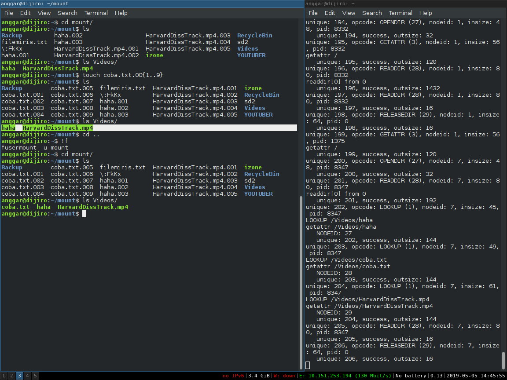
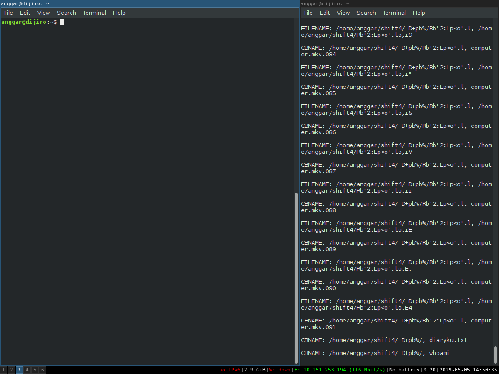
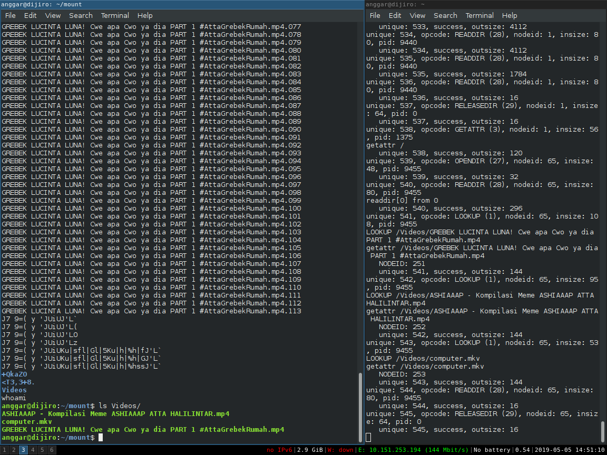
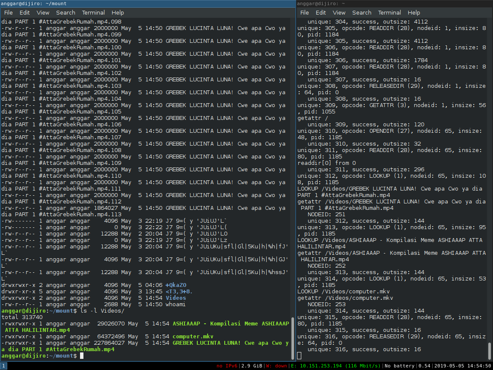
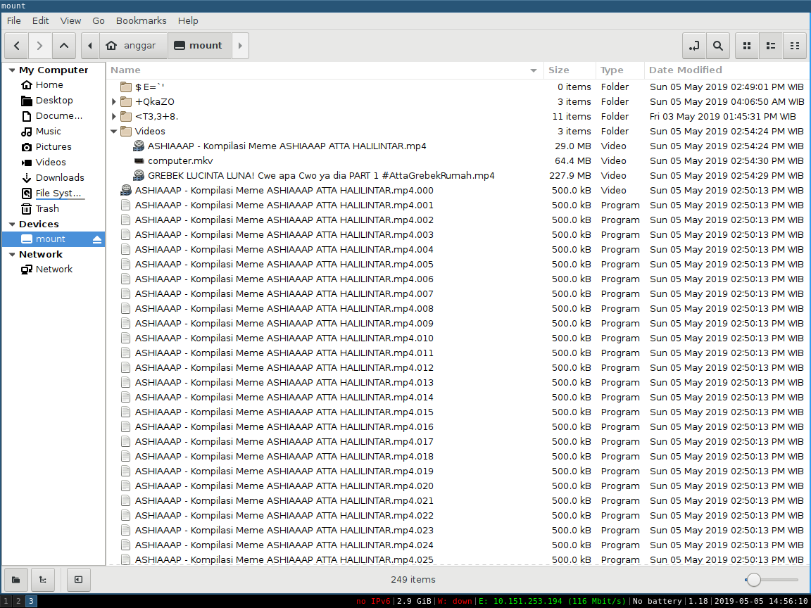

# Nomor 2 

```c
// untuk mendapat nama tanpa ekstensi
int namenoext(char * ppath){
	char *ext = strrchr(ppath, '.'); 

	char fnext[1000];

	if(ext){
		memset(fnext, '\0', strlen(ppath)-strlen(ext)+1);
		strncpy(fnext, ppath, strlen(ppath)-strlen(ext));
	} else {
		strcpy(fnext, ppath);
	}

	char res[1000];

	memset(res, '\0', strlen(ppath)+40);
	sprintf(res, "%s", fnext);

	strcpy(ppath, res);
}
```

Fungsi di atas digunakan untuk mendapatkan nama file tanpa ekstensinya, misal jika berkas tersebut memiliki ekstensi aku.mp4.001 maka akan menjadi aku.mp4

```c
int decalphasort(const struct dirent **a, const struct dirent **b){
	char cstr1[1000];
	char cstr2[1000];

	strcpy(cstr1, (*a)->d_name);
	strcpy(cstr2, (*b)->d_name);

	dec(cstr1);
	dec(cstr2);

	int ret = strcoll(cstr1, cstr2);

	return ret;
}
```

Fungsi di atas digunakan untuk membandingkan dua string yang telah terenkrip, agar dibandingkan secara alfabetis.

```c
static void* pre_init(struct fuse_conn_info *conn){
	// Create Videos folder in main
	char folder[40] = "/Videos";
	enc(folder);
	char fpath[1000];
	sprintf(fpath,"%s%s", dirpath, folder);
	mkdir(fpath, 0775);

	DIR *dp;
	pid_t child;
	int i, n, k;

	char combinename[1000];
	char filename[1000];
	char pathasli[1000];
	char dname_dec[1000];
	char cideos[] = "/Videos/";
	enc(cideos);
	sprintf(combinename, "%s%s", dirpath, cideos);

	// enc(combinename);

	dp = opendir(dirpath);

	if (dp == NULL) return -errno;

	// regex untuk menyocokan berkas yang .001 .002 dst
	reti = regcomp(&regex, ".*\\.[0-9][0-9][0-9]", 0);

	child = fork();

	// child process  buat join vid
	if(child == 0) { // child
		int fp1, fp2;
		char buf[BUFFSIZE];
		struct dirent **dlist;

		// dengan scandir dan komparator kustom
		// decalphasort, dipastikan file
		// akan berurutan
		n = scandir(dirpath, &dlist, 0, decalphasort);
		
		for(i=0; i<n; i++) {
			// dec(combinename);
			//jika file regex sesuai dengan yang diinginkan

			strcpy(dname_dec, dlist[i]->d_name);
			dec(dname_dec);

			// pencocokan berkas dengan regex
			reti = regexec(&regex, dname_dec, 0, NULL, 0);

			if(!reti){ 
				strcpy(filename, dname_dec);
				sprintf(pathasli, "%s/%s", dirpath, dlist[i]->d_name);
				namenoext(filename);
				enc(filename);
				strcat(combinename, filename);
				dec(filename);

				// file yang akan dibaca
				fp1 = open(pathasli, O_RDONLY);

				printf("\nFILENAME: %s, %s\n", combinename, pathasli);

				// could be segfault either because the file
				// directed is folder, or the parent directory
				// doesn't exist
				// fpath file yang akan digabungkan
				// pake mode append
				fp2 = open(combinename, O_WRONLY | O_APPEND | O_CREAT, 0775);

				// pindah kursor ke belakang dulu
				lseek(fp2, 0, SEEK_END);

				// baru append, perlahan demi perlahan
				// sampai isi dari fp1 habis
				while((k = read(fp1, buf, BUFFSIZE)) > 0){
					write(fp2, buf, k);
				}

				// tutup semuanya
				close(fp1);
				close(fp2);
			}

			printf("\nCBNAME: %s, %s\n", combinename, dname_dec);

			sprintf(combinename, "%s%s", dirpath, cideos);
			// enc(combinename);
		}

		free(dlist);
		// execl("/bin/sh", "/bin/sh", "-c", "echo", "haha", NULL);
		exit(0);
	}

	(void) conn;
	return NULL;
}
```

Fungsi diatas merupakan fungsi yang dipanggil ketika fuse kita *mount*. Fungsi tersebut akan melakukan satu kali `fork()` untuk proses penggabungan ekstensi file yang terpisah. Proses di atas sangat bergantung pada berkas yang terurut sehingga berkas penggabungannya juga sesuai. Kemudian, kita mencoba menulisnya ke berkas tujuan di direktori "/Videos/". Proses menulis dan membaca berkas asli dilakukan secara bersamaan. Namun, proses tersebut dilakukan satu-persatu antar berkas yang terpisah, dimulai dari yang kecil terlebih dahulu. Karena kami menggunakan `scandir()` dengan *comparator* `decalphasort()`, dapat dijamin bahwa urutan berkas akan terurut secara alfabetis.

```c
// Ketika akan unmount memanggil fungsi ini
void destroy(void* private_data){
	DIR *dp;
	struct dirent *de;

	char cideos[1000] = "/Videos/";
	char vidpath[1000];
	char filefullpath[1000];
	enc(cideos);
	sprintf(vidpath, "%s%s", dirpath, cideos);

	dp = opendir(vidpath);

	// Membaca seluruh isi dari Videos
	while((de = readdir(dp)) != NULL) {
		sprintf(filefullpath, "%s%s", vidpath, de->d_name);
		// lalu menghapusnya
		remove(filefullpath);
	}

	printf("\n\nTERLEPAS AKU\n\n");

	closedir(dp);
}
```

Kode di atas akan melihat keseluruhan berkas di folder "/Videos/" dan akan menghapus semua yangg didalamnya.

## Tangkapan Layar





